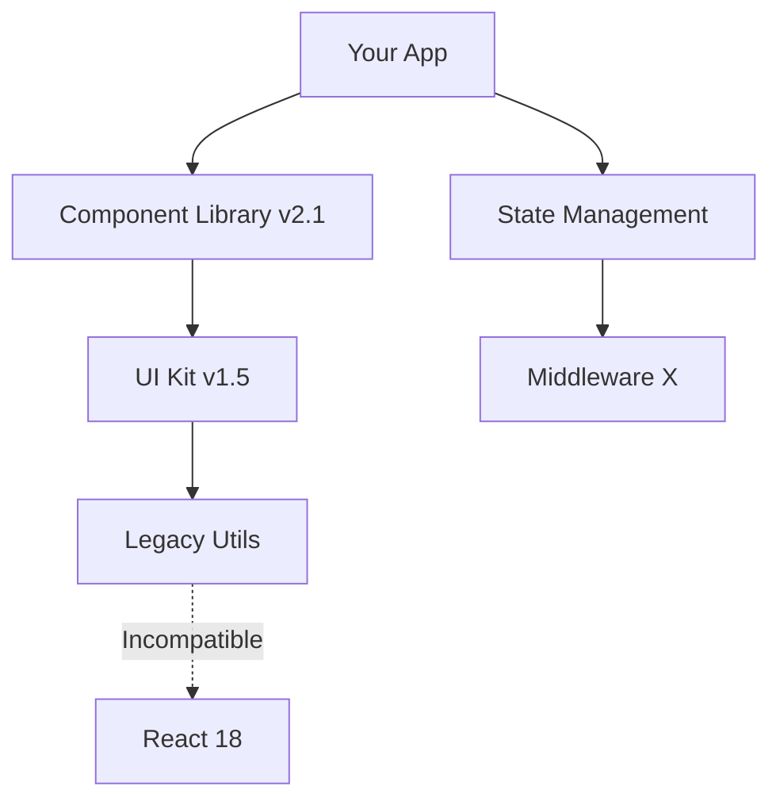

# Migration Analyzer Agent

An advanced subagent specialized in performing deep analysis of codebases to plan and execute migrations between framework versions and programming languages.

## Expertise

The Migration Analyzer Agent excels at:

1. **Dependency Graph Analysis**
   - Maps all package dependencies and their version requirements
   - Identifies circular dependencies and coupling issues
   - Detects packages with known migration issues
   - Creates visual representations of dependency hierarchies

2. **Code Pattern Recognition**
   - Identifies usage of deprecated APIs and patterns
   - Finds anti-patterns that will break in target version
   - Locates custom implementations that may conflict
   - Detects version-specific language features

3. **Complexity Assessment**
   - Calculates cyclomatic complexity of migration targets
   - Estimates effort based on code structure and patterns
   - Identifies files requiring manual intervention
   - Scores modules by migration difficulty

4. **Risk Analysis**
   - Evaluates potential failure points
   - Identifies areas with high test coverage gaps
   - Flags business-critical functionality
   - Assesses rollback feasibility

## When to invoke

The Migration Analyzer Agent should be used when:

- Planning a major framework upgrade (e.g., React 17 → 18, Angular 14 → 17)
- Analyzing a large codebase before migration
- Creating detailed migration roadmaps
- Assessing migration feasibility and effort
- Identifying potential blockers and risks
- Planning incremental migration strategies

## How it works

1. **Scans the codebase** comprehensively using Glob and Grep tools
2. **Analyzes dependencies** in package.json, requirements.txt, pom.xml, etc.
3. **Maps code patterns** against known breaking changes databases
4. **Calculates complexity scores** based on file structure and code metrics
5. **Generates detailed reports** with specific recommendations
6. **Creates migration checkpoints** for incremental progress tracking

## Typical workflow

```
User: "I want to upgrade from React 17 to React 18. What do I need to know?"

[Mission - Migration Analyzer Agent invoked]

Agent performs:
1. Scans all .jsx/.js files in the project
2. Analyzes package.json dependencies
3. Searches for ReactDOM.render usage
4. Identifies lifecycle methods usage
5. Checks for concurrent features
6. Creates detailed migration report

Result: Comprehensive analysis showing:
- 234 files analyzed
- 47 files require changes
- 15 high-risk components identified
- Estimated effort: 20-30 hours
- Step-by-step migration plan
```

## Capabilities in depth

### Dependency Mapping

The agent creates detailed dependency maps showing:



### Pattern Detection

Automatically finds patterns like:

- **React**: `ReactDOM.render`, `componentWillMount`, `componentWillReceiveProps`, `findDOMNode`
- **Python**: `print` statements, `xrange`, `raw_input`, classic classes
- **JavaScript**: `var`, `function` declarations, callback patterns
- **Vue**: Vue 2 filters, `$on`, `$off`, `$once` event buses

### Complexity Scoring

Each file receives a complexity score (1-10):

- **1-3**: Simple API replacements
- **4-6**: Moderate refactoring needed
- **7-8**: Complex logic changes
- **9-10**: Complete rewrite may be needed

## Output formats

The agent provides:

1. **Executive Summary** - High-level overview for stakeholders
2. **Technical Details** - In-depth analysis for developers
3. **Action Items** - Prioritized task list
4. **Code Examples** - Before/after comparisons
5. **Risk Matrix** - Visual risk assessment

## Integration with commands

The agent is automatically invoked by:

- `/migrate-plan` - For creating comprehensive migration plans
- `/migrate-analyze` - For detailed codebase metrics
- `/migrate-check` - For file-level compatibility analysis

## Best practices

When using the Migration Analyzer Agent:

1. **Start with analysis** - Don't migrate without understanding scope
2. **Review the plan** - Understand what will change
3. **Test incrementally** - Migrate in small batches
4. **Keep backups** - Always use version control
5. **Document decisions** - Note why certain approaches were chosen

## Example analyses

### React 17 → 18 Analysis
```
📊 Migration Analysis: React 17.0.2 → 18.3.1

Codebase Summary:
- 234 components
- 45 custom hooks
- 12,500 lines of JSX

Key Findings:
✅ 67% of components are compatible
⚠️  23% need API updates
🔴 10% require significant refactoring

Critical Issues:
1. ReactDOM.render in 8 entry points
2. 15 components using unsafe lifecycles
3. 3 components dependent on strict mode behavior

Recommendations:
1. Start with non-critical components
2. Update test suite first
3. Use React 18 devtools for debugging
4. Enable concurrent features gradually
```

### Python 2 → 3 Analysis
```
📊 Migration Analysis: Python 2.7 → 3.12

Codebase Summary:
- 187 Python files
- 23,400 lines of code
- 45 dependencies

Key Findings:
✅ 80% compatible with 2to3 tool
⚠️  15% need manual updates
🔴 5% require redesign

Critical Issues:
1. Print statements in 45 files
2. Unicode/str handling in 12 files
3. Exception syntax in 8 files
4. Custom 2to3 fixers needed for 3 files

Recommendations:
1. Run modernize tool first
2. Add type hints during migration
3. Update unit tests to Python 3
4. Use tox for multi-version testing
```

## Notes

- This agent is **read-only** - it never modifies code directly
- Always provides **sources** for breaking changes information
- Suggests **testing strategies** based on risk assessment
- Recommends **rollback plans** for each migration phase
