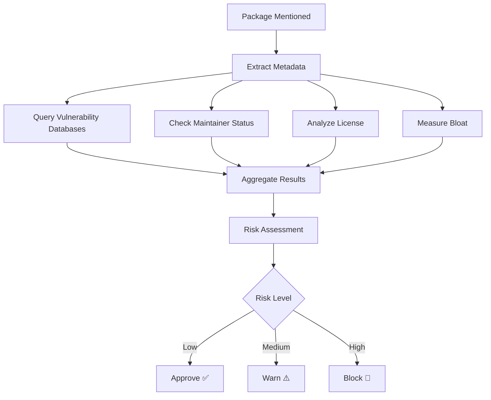

# Dependency Safety Check Skill

Autonomously evaluates dependency safety when working with packages, installation commands, or dependency discussions.

## When Claude Uses This Skill

This skill activates automatically when:
- User runs `npm install`, `yarn add`, `pnpm add`
- User asks about package safety or security
- User reviews PRs with dependency changes
- User discusses dependency issues
- User asks about alternatives to packages
- User mentions CVEs, vulnerabilities, or security

## What It Does

### Before Package Installation

When user runs install commands:
1. **Extract package names and versions** from the command
2. **Run comprehensive safety check** on each package:
   - Security vulnerabilities (CVEs, advisories)
   - Maintainer status (active, abandoned, risky)
   - License compatibility
   - Dependency bloat analysis
   - Acquisition risks
   - Community health
3. **Generate safety report** with recommendations
4. **Block or warn** based on risk level

### During Code Reviews

When reviewing dependency changes:
1. **Compare old vs new versions**
2. **Check for breaking changes**
3. **Verify security improvements**
4. **Assess license compatibility**
5. **Calculate bloat impact**
6. **Recommend approval or rejection**

### During Dependency Discussions

When user asks about packages:
1. **Deep analysis** of mentioned packages
2. **Alternative suggestions** if issues found
3. **Risk assessment** with confidence scores
4. **Actionable recommendations**

## Analysis Process



## Output Format

```
🔍 DEPENDENCY SAFETY CHECK: package-name@version

━━━━━━━━━━━━━━━━━━━━━━━━━━━━━━━━━━━━━━━━━━━━━━━━━━

📋 PACKAGE OVERVIEW
├─ Maintainer: @username (verified ✓)
├─ Published: 3 days ago
├─ Weekly downloads: 2.5M
└─ License: MIT

🔒 SECURITY: SAFE ✅
├─ Known vulnerabilities: None
├─ Security advisories: None
└─ Last audit: Clean (2 hours ago)

👤 MAINTAINER: HEALTHY 🟢
├─ Account age: 5 years
├─ Packages maintained: 8
├─ Last release: 3 days ago
├─ Avg response time: 6 hours
└─ Abandonment risk: LOW (5%)

📄 LICENSE: COMPATIBLE ✅
├─ License: MIT (permissive)
├─ OSI-approved: Yes
├─ Compatible with your project: Yes
└─ Attribution required: Minimal

📦 BLOAT: ACCEPTABLE 🟢
├─ Direct dependencies: 3
├─ Tree size: 12 packages total
├─ Install size: 450 KB
└─ Install time impact: +3 seconds

🏢 ACQUISITION RISK: LOW ✅
├─ Maintainer: Independent
├─ Recent acquisitions: None
└─ Repository: Community-owned

🎯 OVERALL ASSESSMENT: SAFE TO INSTALL ✅

   Confidence: 94%
   Recommendation: Proceed with installation

   💡 TIP: Consider using the ESM version for tree-shaking
```

## Risk Thresholds

### 🔴 CRITICAL - Block Installation
- Active CVEs with no patch
- Malicious code detected
- Maintainer account compromised
- Abandoned with critical issues
- Incompatible licenses (GPL in MIT project)
- Proprietary licenses in open-source projects

### 🟡 HIGH - Warn and Require Confirmation
- Unpatched CVEs (patch available)
- Inactive maintainer (6+ months)
- Recent acquisition by risky company
- Excessive bloat (>50 dependencies)
- Copyleft licenses (GPL, AGPL)
- Non-OSI approved licenses

### 🟢 MEDIUM - Informative Notice
- Maintainer slowing down (3-6 months)
- Moderate bloat (20-50 dependencies)
- Weak copyleft (LGPL, MPL)
- Low-severity CVEs (patched)

### ✅ LOW - Safe to Proceed
- No vulnerabilities
- Active maintainer
- Permissive license
- Minimal bloat (<20 dependencies)
- Healthy community

## Data Sources

### Security Vulnerabilities
- **npm audit** - Built-in vulnerability scanner
- **Snyk DB** - Commercial vulnerability database
- **OSV** - Google's Open Source Vulnerabilities
- **GitHub Advisory** - Security advisories
- **NVD** - National Vulnerability Database (CVEs)

### Maintainer Information
- **npm registry** - Publish history, account age
- **GitHub API** - Commit activity, issue response
- **Libraries.io** - Package metadata, dependencies
- **GitHub discussions** - Community sentiment

### License Data
- **SPDX License List** - Standard license identifiers
- **choosealicense.com** - License descriptions
- **OSI** - OSI-approved license list
- **TLDRLegal** - Plain English explanations

### Bloat Metrics
- **package.json** - Direct dependencies
- **npm ls** - Full dependency tree
- **bundlephobia** - Bundle size, install time
- **package-size** - Real-world size data

## Autonomous Actions

### High Confidence (>90%) - Automatic Action
- **Safe packages**: Allow installation without asking
- **Critical risk**: Block and explain why

### Medium Confidence (70-90%) - Ask User
- **Medium risk**: "This package has [risk]. Proceed?"
- **Uncertain**: "Couldn't verify [aspect]. Manual review recommended."

### Low Confidence (<70%) - Manual Review Required
- **Unknown packages**: "Limited data available. Review recommended."
- **Conflicting data**: "Sources disagree. Manual audit needed."

## Integration with Workflow

### Pre-Install Hook
```bash
# Automatically runs before every npm install
npm install axios
# ↓ Skill activates
# ↓ Runs safety check
# ↓ Displays report
# ↓ Asks: "Safe to proceed? [Y/n]"
```

### Code Review Integration
```bash
# PR adds: "axios": "^1.5.0"
# ↓ Skill activates on PR review
# ↓ Analyzes change
# ↓ Comments on PR:
# "✅ Dependency change approved:
#  - No security issues
#  - Maintainer active
#  - License compatible
#  - Minimal bloat impact"
```

### Dependency Lockfile Analysis
```bash
# When reviewing package-lock.json
# ↓ Skill scans all dependencies
# ↓ Generates summary report:
# "📊 Project Dependency Health: A- (245 packages)
#  🔴 Critical issues: 0
#  🟡 Warnings: 3
#  ✅ Safe: 242
#  Review needed: moment@2.29.4 (abandoned, 70 deps)"
```

## Example Interactions

### Example 1: User Installs Package
```
User: npm install lodash

Claude: 🔍 DEPENDENCY SAFETY CHECK: lodash@4.17.21

✅ SECURITY: No known vulnerabilities
🟢 MAINTAINER: Active (jdalton, 15 years, 50+ packages)
✅ LICENSE: MIT (compatible)
🟡 BLOAT: 71 KB, 0 direct deps (but consider lodash-es for tree-shaking)
🟢 ACQUISITION: Independent, low risk

🎯 ASSESSMENT: SAFE TO INSTALL (Confidence: 96%)

💡 OPTIMIZATION TIP: Consider lodash-es for better tree-shaking

Proceed with installation? [Y/n]
```

### Example 2: User Asks About Package
```
User: Is express safe to use?

Claude: 🔍 DEPENDENCY SAFETY ANALYSIS: express

✅ SECURE - No high-severity CVEs in 2+ years
🟢 MAINTAINED - Active releases, responsive maintainer (@dougwilson)
✅ LICENSE - MIT (permissive, OSI-approved)
🟡 BLOAT - Moderate (27 direct deps, 3.2 MB)
🟢 STABLE - Mature, widely-used (20M+ weekly downloads)

🎯 VERDICT: SAFE (Confidence: 98%)

📊 HEALTH METRICS:
- Last release: 5 days ago
- Avg issue response: 6 hours
- Security fixes: <48 hours after disclosure
- Community: Large, active

⚠️ MINOR CONCERNS:
- Middleware ecosystem fragmented
- Some outdated middleware packages

💡 RECOMMENDATION: Express is production-ready.
   For new projects, also consider Fastify (faster, more modern).
```

### Example 3: Risky Package
```
User: npm install colors

Claude: 🔴 DEPENDENCY SAFETY WARNING: colors

🚨 SECURITY ALERT: Previous maintainer pushed malicious code
├─ Jan 2023: Malicious versions published (1.4.44-lib, 1.4.45)
├─ Maintainer: @marak (sole maintainer, bus factor: 1)
├─ Current: Forked to @colors/colors (community maintained)
└─ Risk: History of malicious updates

👤 MAINTAINER STATUS: HIGH RISK 🔴
├─ Single maintainer (burnout risk)
├─ History of malicious actions
└─ No co-maintainers

🎯 ASSESSMENT: DO NOT INSTALL 🔴

💡 RECOMMENDED ALTERNATIVES:
✅ @colors/colors (community fork, safe)
✅ chalk (more popular, actively maintained)
✅ ansi-colors (zero dependencies)

Use @colors/colors instead: npm install @colors/colors

⛔ BLOCKING INSTALLATION for your safety.
   Override with --unsafe to proceed (not recommended).
```

## Confidence Scoring

Confidence scores determine autonomous actions:

```
HIGH CONFIDENCE (>90%):
- All data sources agree
- Complete metadata available
- Clear risk indicators
- → Automatic decision

MEDIUM CONFIDENCE (70-90%):
- Most data sources agree
- Minor metadata gaps
- Some ambiguity
- → Ask user for confirmation

LOW CONFIDENCE (<70%):
- Conflicting data
- Major metadata gaps
- High uncertainty
- → Manual review required
```

## Error Handling

### Data Unavailable
```
⚠️ LIMITATION: Limited data for package-name

Some checks couldn't be completed:
- Maintainer info: Not found on GitHub
- Bundle size: Not in bundlephobia
- License: Not specified in package.json

🔍 MANUAL REVIEW RECOMMENDED

Available checks passed:
✅ No known vulnerabilities (npm audit)
✅ Published to npm registry

💡 Consider:
1. Checking package repository directly
2. Looking for alternative packages
3. Reviewing source code before using
```

### Conflicting Data
```
⚠️ CONFLICTING INFORMATION: package-name

Data sources disagree:
- npm audit: Clean (no vulnerabilities)
- Snyk: 1 moderate vulnerability (CVE-2023-1234)

🔍 INVESTIGATION NEEDED

This typically means:
- Vulnerability recently disclosed
- Different database update speeds
- False positive in one source

🎯 RECOMMENDATION:
- Treat as vulnerable until confirmed
- Check GitHub for recent security advisories
- Consider waiting 24-48 hours for resolution
```

## Continuous Improvement

### Learning from Corrections
- Track when users override warnings
- Learn from false positives/negatives
- Improve confidence scoring
- Refine risk thresholds

### Feedback Loop
```
User: I installed colors even though you warned, and it was fine.

Claude: Noted. I'll adjust my risk assessment for @colors/colors
   (the community fork) vs the original colors package.

   The fork is now considered SAFE, while the original
   (@marak's version) remains BLOCKED.
```

## Best Practices

1. **Be transparent** - Explain why you're checking
2. **Show confidence** - Display confidence scores
3. **Provide alternatives** - Never just say "don't use"
4. **Respect autonomy** - Let users override with --force
5. **Learn from feedback** - Adjust based on user decisions
6. **Prioritize safety** - Better to over-warn than under-warn
7. **Keep reports concise** - Executive summary first, details on request
8. **Update regularly** - Re-scan when data changes

## Supporting Files

This skill can reference:
- `reference.md` - Detailed package databases
- `scripts/` - Backend scanning logic
- `data/` - Cached vulnerability data

---

**Generated by Dependency Safety Scanner Plugin v1.0.0**
